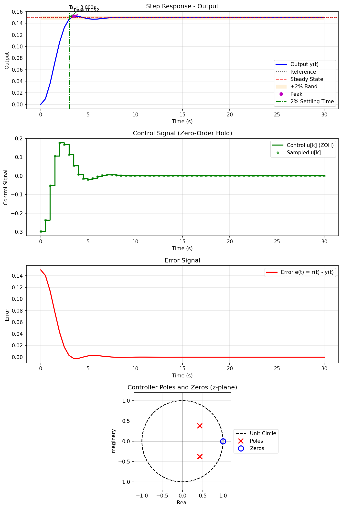

# Hybrid Controller Tuner

A Python tool for automatically tuning discrete-time controllers for hybrid control systems (discrete controller with continuous plant). The tuner uses differential evolution optimization to find controller parameters that meet specified performance requirements such as overshoot and settling time.

## Features

- **System Builder**: Define custom control systems using Python with reusable building blocks
- **Hybrid System Simulation**: Simulates discrete-time controllers with continuous-time plants using Zero-Order Hold (ZOH) discretization
- **Automatic Tuning**: Uses differential evolution to optimize controller parameters
- **Flexible Controller Structure**: Supports arbitrary polynomial controllers (not limited to PID)
- **Nested Control Systems**: Build cascaded control loops (e.g., outer/inner loops)
- **Performance Metrics**: Computes overshoot, settling time, and other step response metrics
- **Visualization**: Generates plots showing output, control signal, and error responses

## Installation

1. Clone this repository:

```bash
git clone "https://github.com/VictorKaraboychev/hybrid-controller-tuner"
cd hybrid-controller-tuner
```

2. Install dependencies:

```bash
pip install -r requirements.txt
```

Required packages:

- `numpy >= 1.21.0`
- `scipy >= 1.7.0`
- `matplotlib >= 3.4.0`

## Usage

### Basic Usage

1. **Define your control system** in `system.py` (see [SYSTEM_BUILDER_README.md](SYSTEM_BUILDER_README.md) for details)

2. **Run the tuner**:

```bash
python main.py
```

The tuner will:

- Read your system definition from `system.py`
- Optimize controller parameters to meet your specifications
- Save the tuned controller to a JSON file (default: `output/controller.json`)
- Generate a response plot (default: `output/response.png`)

### Quick Start Example

Create a `system.py` file with your plant and specifications:

```python
from src.system_blocks import ContinuousTF, Saturation
from src.tune_discrete_controller import (
    PerformanceSpecs, SystemParameters, OptimizationParameters
)

# Define your plant
plant = ContinuousTF(num=[-2.936], den=[0.031, 1.0, 0.0], dt=0.001)
input_saturation = Saturation(min_val=-6.0, max_val=6.0)

def system(controller, r, t):
    e = r - plant.y  # Use plant.y to access last output
    u = controller.step(t, e)
    u = input_saturation.step(u)
    y = plant.step(u)
    return e, u, y

def reset():
    plant.reset()
    input_saturation.reset()

# Define specifications
specs = PerformanceSpecs(
    max_overshoot_pct=5.0,
    settling_time_2pct=0.25,
    max_control_signal=6.0,
)

system_params = SystemParameters(
    sampling_time=0.015,
    num_order=2,
    den_order=3,
    t_end=0.5,
    step_amplitude=1.4,
)

optimization_params = OptimizationParameters(
    population=100,
    max_iterations=1000,
)
```

See [SYSTEM_BUILDER_README.md](SYSTEM_BUILDER_README.md) for complete documentation on building systems.

## Output

### Controller JSON File

The tuned controller is saved as a JSON file with the following structure:

```json
{
  "controller": {
    "numerator": [-0.5564943057180946, 0.5564946941656995],
    "denominator": [1.0, -1.3023616512108467, 0.5148301400280902]
  },
  "structure": {
    "num_order": 1,
    "den_order": 2
  },
  "metrics": {
    "steady_state": 0.9999999988805117,
    "percent_overshoot": 1.96954681658477,
    "settling_time_2pct": 5.0,
    "peak_value": 1.0196954670243106
  },
  "plant": {
    "numerator": [-0.258873],
    "denominator": [1.0, 0.0, 0.0]
  },
  "sampling_time": 0.5
}
```

The controller transfer function D[z] is defined by:

- `controller.numerator`: Numerator coefficients in descending powers of z
- `controller.denominator`: Denominator coefficients in descending powers of z

### Response Plot

The generated plot shows four subplots:

1. **Output Response**: Step response with reference, steady-state, 2% settling band, peak annotation, and settling time marker
2. **Control Signal**: Discrete control signal u[k] shown as Zero-Order Hold (ZOH)
3. **Error Signal**: Error e(t) = r(t) - y(t)
4. **Pole-Zero Plot**: Controller poles (red 'x') and zeros (blue 'o') on the z-plane with unit circle. All poles must be inside the unit circle for stability.



## How It Works

1. **System Definition**: You define your control system in `system.py` using building blocks:

   - `ContinuousTF`: Continuous-time transfer functions (s-domain)
   - `DiscreteTF`: Discrete-time transfer functions (z-domain)
   - `Saturation`: Signal limiting blocks
   - The `system(controller, r, t)` function defines the control loop

2. **Controller Structure**: The discrete controller D[z] is parameterized as a rational transfer function with specified numerator and denominator orders

3. **Optimization**: Differential evolution searches for controller parameters that minimize a cost function based on:

   - Overshoot violation penalty
   - Settling time violation penalty
   - Control signal limit violation penalty (if `max_control_signal` is specified)
   - Steady-state error

4. **Simulation**: Each candidate controller is evaluated by simulating the hybrid closed-loop system:

   - The `system()` function is called at each time step
   - Discrete controller: e[k] → u[k] = D[z]e[k] (handles sampling internally)
   - Zero-Order Hold: u[k] → u(t) (automatic in DiscreteTF)
   - Continuous plant: u(t) → y(t) = P(s)u(t)
   - Error: e(t) = r(t) - y(t), accessed via `plant.y` attribute

5. **Validation**: The final controller is validated and metrics are computed. The tuned controller is saved to JSON and a response plot is generated.

## Tips

- **System Builder**: Use the system builder approach (see [SYSTEM_BUILDER_README.md](SYSTEM_BUILDER_README.md)) - it's more flexible and powerful than JSON configuration
- **Accessing Outputs**: Use the `.y` attribute on transfer functions to access last output values (e.g., `plant.y`, `p1.y`)
- **Strict Properness**: Ensure `num_order < den_order` for a causal, implementable controller
- **Sampling Time**: Choose an appropriate sampling time (typically 10-20x faster than the plant's dominant time constant)
- **Optimization**: Increase `population` and `max_iterations` for better results, but at the cost of longer computation time
- **Optimization Parameters**: For stable controllers, try `mutation=(0.5, 1.0)`, `recombination=0.6`, and `strategy='best2bin'`
- **Nested Systems**: Build cascaded control systems by using one plant's output as another's input
- **Tight Specs**: Very tight specifications (low overshoot, fast settling) may require higher-order controllers or may be infeasible

## Troubleshooting

**"System appears unstable"**: The optimized controller may be unstable. Try:

- Increasing `bound_mag` to allow larger parameter values
- Using a higher-order controller (increase `den_order`)
- Relaxing performance specifications

**Optimization stops early before max_iterations**: This is normal behavior. The optimizer uses a convergence tolerance (`de_tol=0.001` by default) and stops when the relative improvement falls below 0.1%. This indicates convergence to a local minimum. The optimizer may still find better solutions in later iterations, but the improvement rate has slowed significantly. If you want to force full iterations, you can set `de_tol=0.0` in your `optimization_params`.

**Optimization doesn't converge**: Try:

- Increasing `max_iterations` and/or `population` in `optimization_params`
- Adjusting `bound_mag` to a more appropriate range
- Adjusting optimization parameters like `mutation`, `recombination`, or `strategy`

**Controller not meeting specs**: The specifications may be too tight. Consider:

- Relaxing `max_overshoot_pct` or `settling_time_2pct`
- Using a higher-order controller
- Increasing optimization iterations

## License

See LICENSE file for details.
